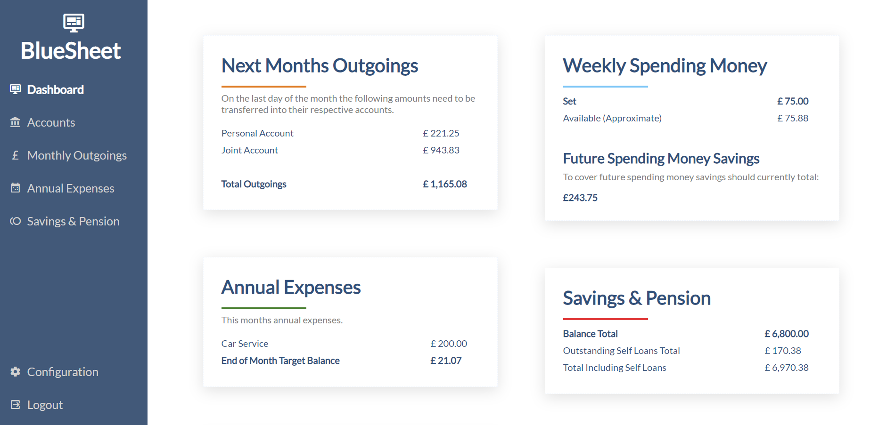
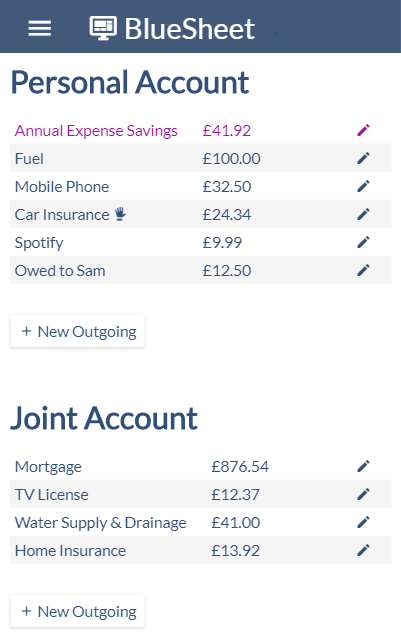

# BlueSheet
A web app to help manage personal finances.




## Introduction
I was looking for a project to improve my (non-existent) HTML and CSS knowledge and so I built this web app to replace a number of spreadsheets I was using to track my own personal finances. It also gave me an opportunity to expolore SQL Alchemy and Jinja templating.

It was designed with the following methodology in mind.

1. Salary is paid monthly and not used until the end of the month.
2. On the last day of the month, enough money to cover all monthly outgoings is paid into the account from which they are taken.
3. The remaining balance (expandable income) is saved and then withdrawn weekly (on the same day every week) throuhout the month.

## Feaures
* Track monthly outgoings and ensure enough money is saved to cover them all.
* Record and save for Annual Expenses - Link a monthly outgoing to your annual expenses so that the money is saved and ready when needed.
* Record savings accounts and pensions to get a total of all savings.
* Link an outgoing to a saving to increase the savings account balance by that amount each month.
* Create "self loans" allowing you to borrow from savings and create a re-payment plan.
* Salary Calculation (UK) - Calculate net salary and see tax, NI and pension breakdown.
* Starling Bank Integration - See your main acocunt and savings goal balances on the dashboard.
* Multiple User Support - Multiple users can each have their own password protected set of data.
* Mobile Responsive.

## Installation
This is a flask python app so can be deployed in [a number of different ways](http://flask.pocoo.org/docs/1.0/deploying/).

The easiest way I have found is to run the app in a Docker container using tiangolo's great [uwsgi-nginx-flask image](https://hub.docker.com/r/tiangolo/uwsgi-nginx-flask). docker-compose can also be used to help things.

Linux Steps:
```shell
# Create an installation directory
mkdir BlueSheet
cd BlueSheet

# Clone the repo
git clone https://github.com/Dullage/BlueSheet.git

# Create a docker and docker-compose file
touch dockerfile
touch docker-compose.yaml

# Create an empty database file
touch BlueSheet.db
```
You should now have an installation directory that looks like this:
* **BlueSheet**
    * docker
    * docker-compose.yaml
    * BlueSheet.db
    * **BlueSheet**
        * **static**
        * **templates**
        * .gitattributes
        * ...

Next open the docker and docker-compose files for editing and add the following (changing variables where necessary).

```dockerfile
# dockerfile
FROM tiangolo/uwsgi-nginx-flask:python3.6

COPY ./BlueSheet /app

RUN pip install -r /app/requirements.txt
```
```yaml
# docker-compose.yaml
version: '3'
services:
  bluesheet:
    build: .
    image: bluesheet
    container_name: "bluesheet"
    # Keep the database outside the container
    volumes:
      - "./BlueSheet.db:/app_data/BlueSheet.db"
    # Tell BlueSheet where to find the database
    environment:
      - DATABASE_PATH=/app_data/BlueSheet.db
      # - "SECRET_KEY=<Secure Password>" # Optional, will be generated on each start if unset.
    # Run on local port 5000
    ports:
      - 5000:80
    restart: "always"
```
Once created, start the app with the following command:
```shell
docker-compose up -d
```
You should now be able to navigate to the login screen at the IP address of the host machine on port 5000.

Now you need to create a user, you can do this from the shell within the docker container:
```shell
# Open a shell in the docker container
command docker exec -it bluesheet /bin/bash

# Create a user
python /app/bluesheet.py add-user -u joe.bloggs@example.com -p MyS3curePwd!
```

When the user first logs in they will be taken to the configuration page.

If a user enters an incorrect password more than 3 times in a row their account will be locked, to unlock an account you can run the following (again from within the docker container):
```shell
python /app/bluesheet.py unlock-user -u joe.bloggs@example.com
```